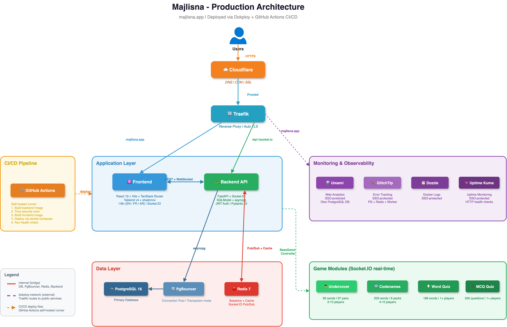

# Majlisna (Islamic Party Games)

A real-time multiplayer platform for Islamized versions of popular party games. Learn about Islamic words, prophets, and concepts while playing with friends.

## Overview

Majlisna brings together classic social deduction, word games, and quizzes, reimagined with Islamic terminology and themes. Players join rooms, get assigned roles, and compete in real-time.

### Key Features

- **Real-time Multiplayer**: Socket.IO for instant state synchronization, with REST API polling fallback
- **Four Games**: Undercover (3-12 players), Codenames (4-10 players), Word Quiz (1+ players), MCQ Quiz (1+ players)
- **Islamic Terminology**: All game words drawn from Islamic concepts, prophets, places, and terms
- **Room System**: Create/join password-protected rooms, invite friends, share room links, manage game settings
- **Spectator Mode**: Watch games in progress without participating
- **Player Statistics**: Track wins, games played, achievements, and leaderboard rankings
- **Achievements & Challenges**: Unlock badges for milestones and complete daily/weekly challenges
- **Internationalization**: English, French, and Arabic (RTL) with full bidirectional support
- **Light/Dark Mode**: Emerald green + gold themed UI with automatic dark mode
- **PWA**: Installable as a web app with offline navigation shell

## Architecture



### Tech Stack

| Component | Technology |
|-----------|------------|
| **Backend** | Python 3.12, FastAPI, SQLModel, SQLAlchemy (async) |
| **Database** | PostgreSQL 16 (prod), SQLite (dev) |
| **Connection Pooling** | PgBouncer (transaction mode) |
| **Auth** | JWT (python-jose, bcrypt) |
| **Frontend** | React 19, TypeScript, TanStack Router/Query, Tailwind v4, shadcn/ui |
| **Real-time** | Socket.IO (python-socketio + socket.io-client) |
| **Caching** | Redis 7 (Socket.IO pub/sub + TTL cache) |
| **API Codegen** | Kubb (OpenAPI -> React Query hooks) |
| **i18n** | i18next (English + French + Arabic with RTL) |
| **Testing** | pytest (backend, 587 tests), Vitest (frontend, 166 tests), Playwright (E2E, 145 tests) |
| **CI/CD** | GitHub Actions (self-hosted runner on VPS) |
| **Deployment** | Docker + Dokploy (Oracle Cloud VPS) |
| **Domain** | `majlisna.app` (Cloudflare DNS + proxy) |
| **Reverse Proxy** | Traefik (managed by Dokploy) |
| **Security** | Trivy (CI vulnerability scanning) |
| **Monitoring** | Umami (analytics), GlitchTip (errors), Dozzle (logs), Uptime Kuma (uptime) |

### Monorepo Structure

```
Majlisna/
├── backend/                    # FastAPI (REST + Socket.IO)
│   ├── majlisna/
│   │   ├── api/               # REST API + WebSocket
│   │   │   ├── controllers/   # Business logic + game logic
│   │   │   ├── models/        # SQLModel DB tables
│   │   │   ├── schemas/       # Pydantic request/response models
│   │   │   ├── routes/        # FastAPI routers (thin, delegate to controllers)
│   │   │   ├── ws/            # Socket.IO server, handlers, notify, state
│   │   │   ├── services/      # External integrations
│   │   │   ├── constants.py   # All magic values
│   │   │   └── middleware.py  # Security, request ID, logging (pure ASGI)
│   │   ├── app.py             # FastAPI app factory
│   │   ├── database.py        # Async SQLAlchemy engine
│   │   ├── dependencies.py    # DI with Annotated + Depends
│   │   └── settings.py        # Multi-env pydantic-settings
│   ├── tests/                 # pytest suite (587+ tests)
│   ├── scripts/               # Fake data generation + seed data
│   └── main.py                # Entry point
├── front/                     # React 19 SPA
│   ├── src/
│   │   ├── api/               # ky HTTP client + Kubb generated hooks
│   │   ├── components/        # UI components (shadcn/ui)
│   │   │   └── games/         # Game-specific + shared components
│   │   ├── hooks/             # Custom hooks (useSocket, etc.)
│   │   ├── i18n/              # English + French + Arabic translations
│   │   ├── lib/               # Utilities (cn, auth)
│   │   ├── providers/         # Auth, Query, Theme, Socket providers
│   │   └── routes/            # TanStack Router (file-based)
│   └── vite.config.ts
├── e2e/                       # Playwright E2E tests (145 tests)
│   ├── tests/
│   │   ├── auth/              # Login, register, token refresh
│   │   ├── rooms/             # Room CRUD, join/leave, share links
│   │   ├── undercover/        # Full game flows, multi-round
│   │   ├── codenames/         # Full game flows
│   │   ├── cross-flow/        # Cross-game interactions
│   │   ├── profile/           # User profile, stats
│   │   └── smoke/             # Health checks
│   ├── helpers/               # Shared test utilities
│   └── playwright.config.ts
├── docs/                      # Architecture diagrams
├── docker-compose.yml          # Local development
├── docker-compose.dokploy.yml  # Production (Dokploy on Oracle VPS)
└── .github/workflows/          # CI/CD pipelines
```

### Backend Design

- **Route -> Controller -> Model**: No business logic in routes — routes delegate everything to controllers
- **BaseGameController**: All 4 game controllers inherit shared methods (`_get_game`, `_check_is_host`, `_update_heartbeat_throttled`, `_check_spectator`, `_resolve_multilingual`)
- **Async Everything**: All database operations and external calls are async
- **Dependency Injection**: FastAPI's `Depends()` with `Annotated` type hints
- **REST + Socket.IO**: Mutations go through REST API. Socket.IO pushes state updates to clients after mutations. PostgreSQL is the only source of truth.
- **Game State in PostgreSQL**: `Game.live_state` JSON column stores full game state

### Deployment

| Environment | Infrastructure | Backend | Frontend |
|-------------|---------------|---------|----------|
| **Production** | Oracle Cloud VPS + Docker + Dokploy | behind Traefik | behind Traefik |
| **E2E Testing** | Docker Compose (isolated stack) | `localhost:5049` | `localhost:3049` |
| **Local Dev** | Docker Compose or bare metal | `localhost:5111` | `localhost:3000` |

### CI/CD

A GitHub Actions workflow on push to `main` (self-hosted runner on the VPS):

1. **Detect changes** — Path-based diff determines which components changed
2. **Rsync** — Syncs code to the Dokploy compose directory
3. **Build** — Selectively rebuilds changed services
4. **Trivy scan** — Vulnerability scanning on backend image
5. **Deploy** — Rolls out via docker-compose
6. **Health check** — Polls `GET /health`
7. **Cleanup** — Prunes old Docker images

## Games

### Undercover (3-12 players)

Social deduction game where each player receives an Islamic term. The undercover agent receives a *different but related* term and must blend in during discussion rounds. Civilians vote to find and eliminate the undercover.

**Roles:** Civilian, Undercover, Mr. White (not in 3-player games)
**Flow:** Discuss -> Vote -> Eliminate -> Repeat until a team wins
**Data:** 95 words, 67 term pairs

### Codenames (4-10 players)

Two teams (Red and Blue) compete to identify their agents on a 5x5 board of Islamic terms. Each team has a Spymaster who gives one-word clues and Operatives who guess.

**Roles:** Spymaster, Operative
**Flow:** Spymaster gives clue -> Operatives guess -> Turn passes -> Repeat
**Data:** 203 words across 9 themed packs

### Word Quiz (1+ players)

Guess the Islamic term from progressive hints. 6 hints revealed over time, from vague to specific. The faster you answer, the more points you earn.

**Data:** 189 trilingual words (EN/FR/AR)

### MCQ Quiz (1+ players)

Test your Islamic knowledge with multiple choice questions. Configurable timer and round count.

**Data:** 500 trilingual questions across 8 categories

## Quick Start

### Prerequisites

- Python 3.12+ with [uv](https://docs.astral.sh/uv/)
- [Bun](https://bun.sh/) runtime
- PostgreSQL (or SQLite for local development)

### Backend

```bash
cd backend
uv sync --dev
cp .env.example .env.development
# Edit .env.development with your config
echo "MAJLISNA_ENV=development" > .env
uv run python main.py
```

API available at `http://localhost:5111`

### Frontend

```bash
cd front
bun install
bun dev
```

Frontend available at `http://localhost:3000`

### Docker (all services)

```bash
docker compose up -d
```

This starts PostgreSQL, backend, and frontend.

| Service | URL |
|---------|-----|
| Backend API | `http://localhost:5051` |
| Frontend | `http://localhost:3051` |

### Generate Test Data

```bash
cd backend

# Create tables and seed with test users, games, words, achievements
PYTHONPATH=. uv run python scripts/generate_fake_data.py --create-db

# Delete all data
PYTHONPATH=. uv run python scripts/generate_fake_data.py --delete
```

### Test Accounts

The seed script creates a handful of local test users. Their credentials are
defined in `backend/scripts/generate_fake_data.py` — they are intended for local
development only and must never be seeded against a deployed environment.

## Development

### Backend

```bash
cd backend

uv run python main.py                    # Start server on :5111
uv run poe lint                          # Ruff lint
uv run poe format                        # Ruff format
uv run poe check                         # All checks (lint + format + type)
uv run pytest --use-postgres             # Run tests with PostgreSQL
uv run poe test-fast                     # Stop on first failure
```

### Frontend

```bash
cd front

bun dev                                  # Dev server on :3000
bun run generate                         # Generate API client (backend must be running)
bun run lint                             # oxlint
bun run typecheck                        # TypeScript strict
bun run test                             # Vitest
bun run test:coverage                    # With coverage
```

### E2E Tests

```bash
cd e2e

# Start the E2E Docker stack
bun run docker:up

# Run full suite (145 tests)
bun run test

# Run specific test suites
bun run test:smoke
bun run test:auth
bun run test:rooms
bun run test:undercover
bun run test:codenames
bun run test:cross-flow
bun run test:profile

# View HTML report
bun run report

# Tear down
bun run docker:down
```

### Environment Configuration

The backend uses `MAJLISNA_ENV` to select which `.env.{env}` file to load:

| File | Purpose |
|------|---------|
| `backend/.env` | Selector: `MAJLISNA_ENV=development` |
| `backend/.env.development` | Local dev config (SQLite) |
| `backend/.env.production` | Production config (PostgreSQL) |
| `backend/.env.example` | Reference template (committed) |

## API Documentation

- **Scalar UI**: `http://localhost:5111/scalar`
- **OpenAPI JSON**: `http://localhost:5111/openapi.json`
- **Health check**: `http://localhost:5111/health`

## Production URLs

- **Frontend**: https://majlisna.app
- **Backend API**: https://majlisna.app/api/v1/
- **Health check**: https://majlisna.app/health
- **API docs**: https://majlisna.app/scalar

### Internal Tooling

Analytics, error tracking, log streaming and uptime monitoring are self-hosted
alongside the application. They sit behind SSO on private hostnames and are not
publicly listed.

## Git Conventions

[Conventional Commits](https://www.conventionalcommits.org/) with emojis:

```
feat(auth): ✨ add JWT token refresh endpoint
fix(game): 🐛 fix vote counting in undercover
refactor(models): ♻️ migrate to async database
ci: 🚀 add GitHub Actions CI/CD pipeline
```

## License

This project is proprietary and confidential.

---

Built with [FastAPI](https://fastapi.tiangolo.com/) and [React](https://react.dev/)
